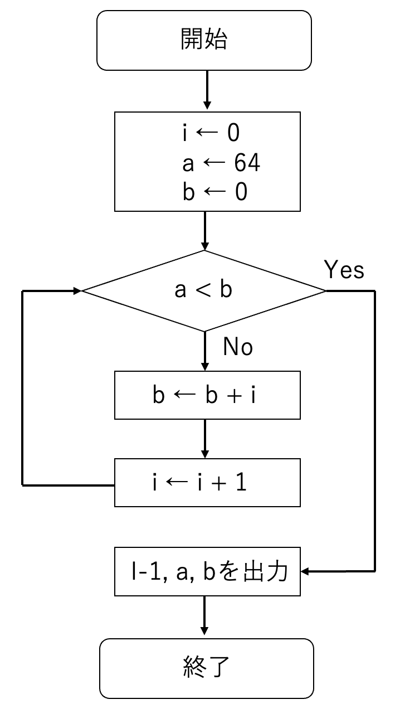

## プログラム言語

python（パイソン）は、様々な用途に利用可能なプログラミング言語の１つである。プログラミングとは、「コンピュータに処理させたい事柄をコンピュータが分かる言葉で指示する行為」のことで、プログラミング言語には機械にとって理解しやすい低水準言語（機械語とアセンブリ言語）と人間の言葉に近い形式で記述できる高水準言語（FortranやC言語など）がある。pythonは高水準言語に分類される。また、高水準言語はコンパイル型とインタプリタ型に分けることができる[*]が、pythonはインタプリタ型の言語に分類される（pythonの他にインタプリタ言語で最近統計学の解析によく使われる言語としてR（アール）がある。Rは後期に開講する医学統計学演習で学ぶ）。

**コンパイラ言語はソースプログラムを機械語に変換するプロセスが必要だが、インタプリタ言語は１ステップ（１行）ごとに機械語に解釈しながら実行してくれる。*

pythonは様々なOSに対してフリーでインストールできるインタプリタ型の高水準言語（スクリプト言語）である。Matlab（マトラボ）などの有償のプログラミング言語とは対照的に、pythonをマスターしておけばPCさえあればプログラミングを行う環境を無償で構築することができる。また、これまで科学技術計算において中心的なプログラム言語であったC言語やFortranに比べ直感的に使うことができ、プログラミング初級者が最初に学ぶ言語として最適なものの１つに挙げられている。科学技術研究分野で発展してきたC言語やFortranで書かれたプログラム（ライブラリ）を網羅的に組み込んでおり、C言語やFortranを理解することなしにそれらを簡単に利用することができるようになっている点も、初級者にとってはありがたい[**]。近年ではGoogleの研究グループが開発したTensorflowというディープラーニング系のライブラリが公開され、利用者が爆発的に増えている。量子コンピュータもpythonを使って簡単に動かすことができるようになっている。

***軽い気持ちでプログラミングを始められるという良い面もあるが、中身を理解していないのにわかった気になるユーザーが出てきてしまう悪い面もある。*

pythonが使えるようになると高度な実験解析が可能になる。医療の分野でも広く使われており、学部の間に基礎を習得しておくことで就職先や大学院進学後にアドバンテージを得ること間違いないでしょう。Windows, Mac, Linuxなど様々な OS 用の python 実行環境が提供されているので、自分が所有するパソコンには必ず入れておきましょう。

なお、栄華を極めているpythonだが、pythonに代わるプログラム言語が出現することも歴史は否定しておらず、10年後, 20年後も同じ状況であるかはわからない。今後50年は大丈夫、と言える言語はC言語くらいでしょう。本気でプログラムを勉強したい人はC言語（とC++）を学ぶことを強く勧めます[***]。C言語はほとんど全てのコンピュータで使うことができ、コンピュータの最もコアな部分にも使われている言語の１つであり、コンピュータがなくならない限りなくならないでしょう。例えば、今後の発展によって世界を大きく変えると想像される量子コンピュータが普及するような時代になったとしても、まずはC言語との互換性をルール化すると考えられます。C言語に関しては、みなさんがリタイアするくらいまでなら残っていることでしょう。もっと不変な言語を望む人は物理学を真剣に学びましょう。物理学を押さえておけば、（理論上には）原理から出発してどのような科学技術の発展にも対応できる能力を獲得できます（そして、プログラム言語の多くは物理学の研究の中で必要となったために物理屋が開発に関わってきました）。

****深層学習を一般の人でも使えるように公開されたTensorflowも、大元はC言語に近いCUDA言語（Graphycal Processing Unit; GPUで並列化計算を容易にできるようにしたC言語をベースにした言語）で書かれており、それをpythonで実行できるようにしています。なので、もし自分でTensorflowの発展バージョンを大元から作ろうと思ったら、CUDA言語を勉強しないといけません。*

本講義では、学生が自分のノートPCを使ってpythonのコードを走らせます。そのための準備としてpythonのインストールおよびプログラムを書くためのエディタ（Editor）のインストールが終わっていることが前提で進めていきます。pythonは、windowsではanaconda prompt、macではターミナルを使って動かせるか確認してください。また、エディタとしてVisual Stadio codeが起動できるどうかも確認してください（これらは1年生のデータ科学入門で既に設定されているはずです）。

## Hello world! in python

pythonはインタプリタ言語です。
インタプリタ言語であることをまずは実感してもらいます。
Macの人はターミナルを立ち上げて、Windowsの人はAnaconda Promptを使って、次のように打ちエンター（Enter）キーを押しましょう。
```sh
python --version
```
バージョンが3以上であればこのまま以下を続けてください。
```sh
python
```
すると、">>>"というようにコンソール画面に変わるかと思います。今、pythonの世界にいるということを意味します。そこで1+1と打ちましょう。
```sh
>>> 1+1
```
2という答えが返ってきましたか？このように、１行ずつ解釈して実行してくれるプログラム言語がインタプリタ言語です。C言語では<u>コンパイル</u>という作業が必要で、これは人間が理解できる内容（プログラム）を一旦機械語に翻訳する作業です（機械語で書かれているのが実行ファイルが生成される）。pythonは翻訳作業も一気にやってくれるため、プログラム初級者にはすごくわかりやすく扱いやすい言語になっています。Hello world!という文字列を返してくれる操作は、
```sh
>>> print(``Hello world!")
```
でいけてしまいます。
しかし、１行１行打って作業をするのはしんどいです。ファイルにまとめて書いたものを一気に実行してくれるとありがたい時がありますし、編集や改変も簡単で便利です。「実行内容をファイルにまとめて書いたもの」をスクリプトと呼びます。次に、それを作成し動かしてみます。そのために一旦pythonから抜けます。
```sh
>>> exit()
```

## スクリプト（script）
では、Hello.pyという名前のファイルをダウンロードしましょう。エディタ（Visual Stadio codeをインストールしていればそれを使いましょう。他のエディタ、例えばEmaxやMacの場合はXcodeなどでもOK）を開いて中身を確認してください。

*（Hello.pyファイルの中身）*
```sh
print("Hello world!") 
```
確認したら、ターミナルで次のように打ちましょう。
```sh
python Hello.py
```
Hello world!が表示されましたか？「python Hello.py」としてEnterを打つことを「（pythonプログラムもしくはスクリプトの）実行(execute)」と言います。python **** と打つことで****に書かれたファイルの内容（スクリプト）が上から順に実行されます。スクリプトを使うことでいろいろなことができるようになります。
例えばHello.pyを次のように編集してみましょう。

*（Hello.pyファイルの中身）*
```sh
x = 10
y = 20
x = x + y
print(``Hello world!: x = ", x) 
```
保存したら、また次を実行しましょう。
```sh
python Hello.py
```
何が出力されたでしょう？
どうしてそのように出力されたのか、説明できますか？
同じ結果は以下でも得ることができます。

*（Hello.pyファイルの中身）*
```sh
x = 10
y = 20
x += y
print(``Hello world!: x = ", x) 
```
このように、インタプリタ言語でファイルに実行する手順を書いて実行することをスクリプト処理という時があります。そのファイルをスクリプトと呼んでいます。pythonではスクリプトを作成することがプログラミングするということです。

高度なスクリプトを作成するためにはいくつかのルールを覚えなければなりません。このルールを本講義で少しずつ学ぶことになりますが、まずはfor文, while文、if文を取り上げたいと思います。
```sh
for i in range(10):
    x += i
    if i % 2 == 0: # i//2*2 == i でも良い
    y += i 
print("(x, y) = (", x, ",", y, ")") 
```
何が出力されたでしょうか？なぜそのような出力になったのかを考えましょう（forの後やifの後はインデント（タブ）を必ず入れる。#はコメントアウト、その行の以降に書かれている文は実行時に無視される）.

また、
```sh
for i in range(10):
```
を
```sh
i = 0 
while i < 10:
    i += 1
```
と変えてみてください。これはiが10未満である限りループを続けることになり、for文のように繰り返し処理に使うことができます。


## データの入出力

データの入出力ができるようになると、やれることが拡がります。1. データを入れて、2. 学習させて、3. 予測結果を返す、というAIの基本構造の最初(1)と最後(3)の部分です。出力をさらに解析にかける、ということも頻繁に行うため、出力データの設計もよく考えてやらなければなりません。この講義では、csvファイルの入出力について学びます。任意のテキストファイルや画像の入出力についてはのちに必要に応じて学ぶこととします。

output.csvをダウンロードして自分のいるディレクトリにおいてください。このcsvファイルを読み込み、２列目と３列目の和を4列目に追記してその結果をoutput2.csvという名前で出力してみます。（カンマ区切りで書かれた）csvデータの入出力や編集にはpandasというライブラリを使うと便利です。この機能を使うために import pandas as pd と最初に宣言します。次のようにファイル（input_output.py）を作成しましょう。

*(input_output.pyのファイルの中身)*
```sh
import pandas as pd

df = pd.read_csv("output.csv", encoding="SHIFT-JIS")
print(df)
df["total"] = df["sin_2px"]+df["noise"]
print(df)
df.to_csv("output2.csv", index=None, encoding="SHIFT-JIS")
```
出力結果はどうでしたか？output2.csvが新たに生成されたでしょうか？（実行時にpandasのエラーが出た人は, pythonではなくpython3で実行してみること）

pandasで事が足りればこれだけで済みますが、pandasではないデータ形式を出力したくなる時があります。
よくあるのは、数値計算で使われるNumpy形式で書かれたデータを出力することです。その場合も本演習では常にpandasのデータフレームに直してからpandasを使ってcsvファイルで保存しましょう（これらの相互変換については、必要性が生じたときに説明します）。


## グラフの書き方
まずはインタラクティブにoutput.csvを使ってグラフを生成してみたいと思います。pythonを起動します。
```sh
python 
```
続いて、ライブラリをインポートします。pandasのほか、グラフ作成用にmatplotlib.pyplotというライブラリを使います。
```sh
>>> import pandas as pd
>>> import matplotlib.pyplot as plt
```
では、データを読み込みましょう。
```sh
>>> df = pd.read_csv("output.csv",encoding="SHIFT-JIS")
>>> df
```
output.csvのファイルの中身が出力されましたね？では、横軸を項目x、縦軸を項目sin_2pxとして散布図を描いてみます。
```sh
>>> plt.scatter(df["x"], df["sin_2px"], color="blue",label="sin_2px")  
>>> plt.show()  # 図の出力
```

グラフが出力されましたか？
plt.scatterの代わりに
plt.plotを使うとデータ間を直線でつなぐことができます。
```sh
>>> plt.plot(df["x"], df["sin_2px"], color="blue",label="sin_2px")  
>>> plt.show()  # 図の出力
```
オプションでmarkerを使うと、データ点を表示させることができます。
```sh
>>> plt.plot(df["x"], df["sin_2px"], marker="o", color="blue",label="sin_2px")  
>>> plt.show()  # 図の出力
```

ラインの幅や種類はオプションのlwやlsを使う。
```sh
>>> plt.plot(df["x"], df["sin_2px"], marker="o", ls=":", lw=4, color="blue",label="sin_2px")  
>>> plt.show()  # 図の出力
```
プロットの範囲はplt.xlimとplt.ylimを使う。凡例はplt.legend、レイアウトの自動調整plt.tight_layout()を入れてプロットする。
```sh
>>> plt.plot(df["x"], df["sin_2px"], marker="o", ls=":", lw=4, color="blue",label="sin_2px")  
>>> plt.xlim(-2,2) # xの範囲
>>> plt.ylim(-2,2) # yの範囲
>>> plt.legend() # レジェンドを追加
>>> plt.tight_layout() # レイアウトの自動調整（常に書いておくと良い）
>>> plt.show()  # 図の出力
```


**練習１**：
項目sin_2pxの代わりにnoiseをy軸にとり、$x = [-1,1]$, $y = [-1, 1]$の範囲で散布図を作成せよ。


複数のグラフを書くには、pltを続けて入力し、最後にplt.show()で出力させれば良い。\\
```sh
>>> plt.plot(df["x"], df["sin_2px"], marker="o", ls=":", lw=4, color="blue",label="sin_2px")  
>>> plt.scatter(df["x"], df["noise"], color="red",label="noise")  
>>> plt.show()  # 図の出力
```

**練習２**：
上記のグラフを出力するスクリプトを作成せよ。


## 演習レポート
* 図に示されるフローチャートをプログラムで作成してみよう。manabaのレポートに、作成したスクリプトを貼り付けて<u>解説</u>をしてください。

演習問題：このチャートをプログラム化せよ！

