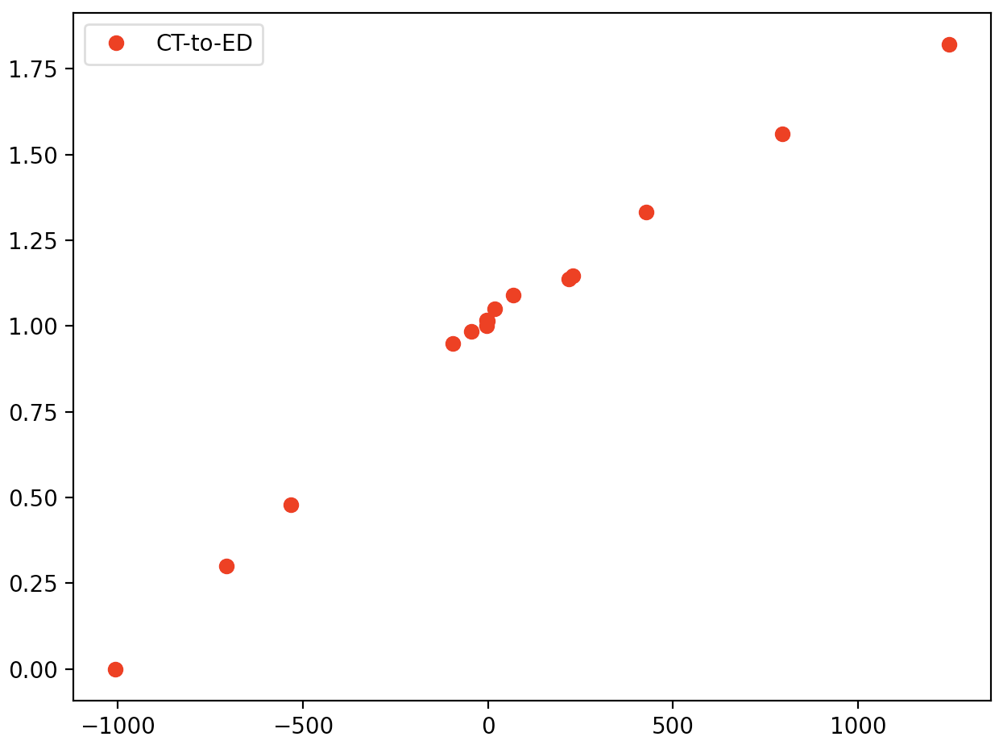
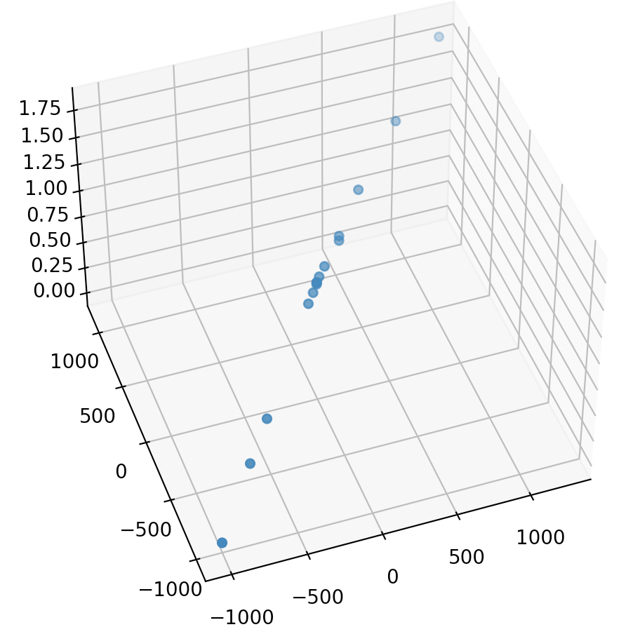
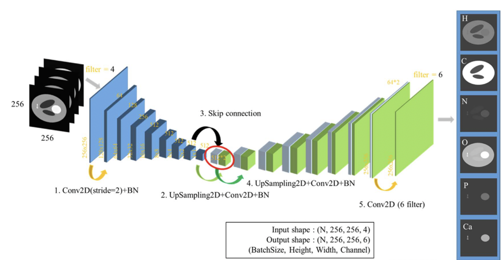
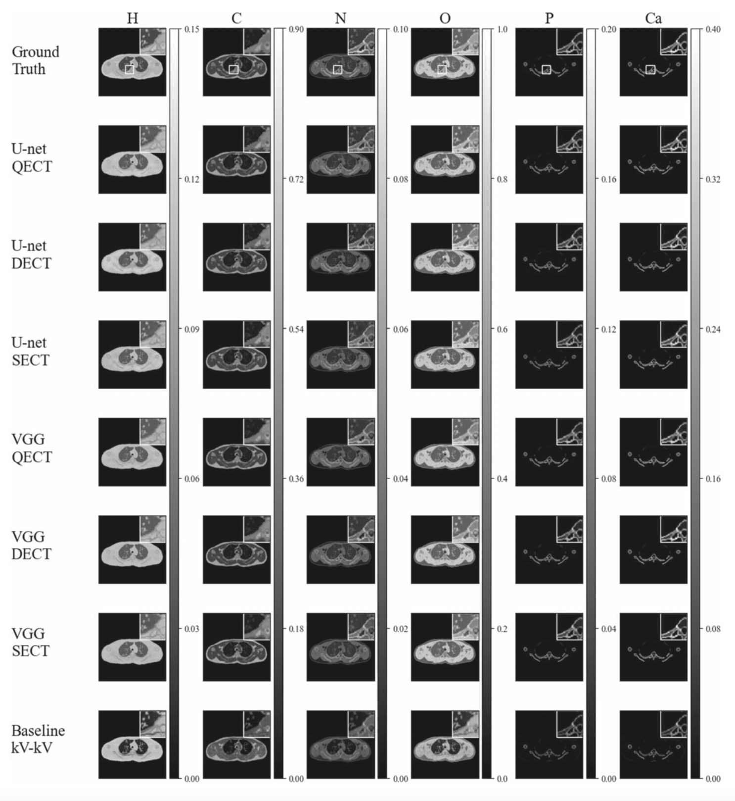
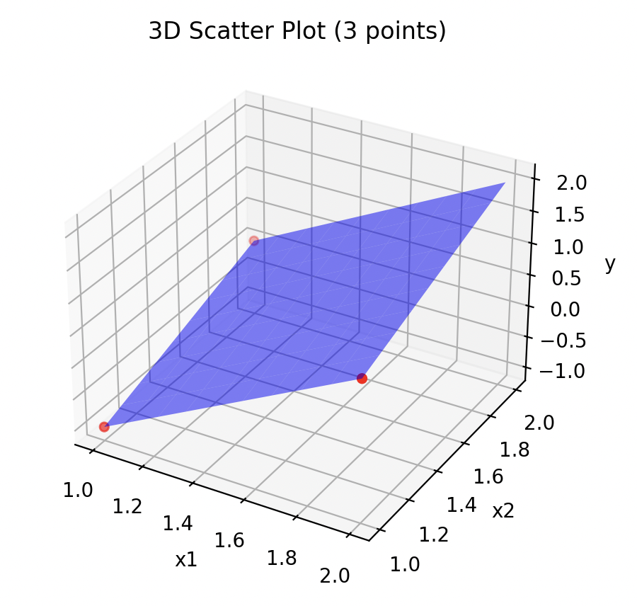

# 最小二乗法と重回帰分析
これまで学んできた最小二乗法（広い意味では最尤推定、事後分布最大化）は説明変数と目的変数が１つずつでした。
例えば、3~5回目の講義で行ったCT-密度変換テーブルの直線フィッティングでは、横軸をCT値、縦軸を密度として直線様に並んだデータを最良近似する$y=ax+b$の傾き$a$と切片$b$を求めたが、この場合の$x$（CT値）が説明変数であり、$y$（密度）が目的変数である。
未知のCT値が入力となった時、対応する密度が何になるのかは$y=ax+b$から求まる。したがって$ax+b$はデータによって決まった$a,b$によって密度を予測するモデルであるということができる。


さて、入力として１つだけではなく２つ以上にして$y$を予測することもできないだろうか？上の例では、CTで使う管電圧を変えて、異なるX線で撮影したCT画像のCT値から密度を予測するということができないだろうか？？
この時、入力データを($CT_{high}, CT_{low}$)として、高低エネルギーのX線で得られたCT値から密度を予測することになるので、入力は２つの説明変数（２成分のベクトル）、出力は１つのスカラー値である。予測に使うデータの次元が増えるため、精度も上がるような気がしないだろうか？[*]

**ただし、次元が増えすぎると別の問題が生じることもわかっている（次元の呪い）*

さらに、出力も１つの値だけでなく、２つ以上の値（ベクトル）であることも考えられる。上の例では、密度だけでなく元素の種類（具体的には実効原子番号）を出力するということも考えられられないだろうか？
興味のある人は[jsmp_s2021.pdf](jsmp_s2021.pdf)を参照のこと。

これまで学んできた最小二乗法と最尤推定、さらに正則化やその枠組みを統一的に捉える事後分布最大化法は、多変量の入力・出力を包含した理論である。つまり、これまで一変数入力ー一変数出力というものだけではなく多変量入力ー多変量出力を可能にする手法である。ここでは、多変量に拡張した枠組みで最小二乗法をもう一度見直し、演習では多変量入力である数値を予測する手法をプログラミングで実行する。データには全前立腺切除を受けた97人の男性について、前立腺特異抗原（PSA）の値と臨床的な8つの変数との関係性を調査したStamey (1987)のデータを使用し、８つの説明変数からPSAを予測するモデルを作成する。

{width=10cm}<br>
*図1:CT密度変換テーブルのデータ例*

{width=10cm}<br>
*図2:２つのCTと対応する密度。２つのCT値の情報から単一の密度を推定する*

{width=10cm}<br>
*図3:Multi enegy CTによる元素密度分布の推定（入力:Multi energy CT, 出力:元素密度分布。*

{width=10cm}<br>
*図4:推定された元素密度(D. Fujiwara. et al., Virtual computed-tomography system for deep-learning-based material decomposition, Phys. Med. Biol. 67, 2022, 155008)*

## 最小二乗法再訪
直線近似のための最小二乗法は、「データを再現する関数$y=ax+b$の$a,b$を求める」という問題と見做せる。

$${\cal L} = \frac{1}{2}\sum_n^N (y(x_n)-t_n)^2 = \frac{1}{2}\sum_n^N ((ax_n+b)-t_n)^2 \hspace{2mm}\cdots(1)$$

を最小にする$a,b$を求めれば良い。ここでこれまでは$x$はスカラーであるとみなしてきた。今度はこれがベクトルであっても良いとしよう。そうすると、関数$y=ax+b$は

$$
y = \vec{a}\cdot\vec{x} + b\cdots(2)
$$

と変更することでベクトル$\vec{x}$の情報からスカラー値$y$を求めることができるようになる。さらに、もし推定したい$y$がベクトル$\vec{y}$であった場合はどうであろうか？
今度はもう少し深く考えないといけない。なぜなら、入力と出力の成分の数（次元数）が異なっているかもしれないからである。
具体的な例で考えると分かり易いので、出力が$\vec{y}=(y_1,y_2)$で入力が$\vec{x}=(x_1,x_2,x_3)$であるとしよう。エネルギーが異なる３つのCT画像を入力として、密度と実効原子番号を２つの求める値（出力）というようなケースをイメージすれば良い。その場合、

$$
\begin{pmatrix}
y_{1} \\
y_{2}
\end{pmatrix} =
\begin{pmatrix}
\hspace{2mm}a_{11} & a_{12} & a_{13}\\
\hspace{2mm}a_{21} & a_{22} & a_{23}
\end{pmatrix} 
\begin{pmatrix}
x_{1} \\
x_{2} \\
x_{3} 
\end{pmatrix}
+
\begin{pmatrix}
b_{1} \\
b_{2} 
\end{pmatrix}
\hspace{2mm}\cdots(3)
$$

となれば$x,y$の次元が合うことがわかるであろう。
つまり、一般的に

$$
\vec{y} = A\vec{x} + \vec{b}\cdots(4)
$$

とすれば良い。ただし、$A$は行列であり、出力$\vec{y}$がm次元、入力$\vec{x}$がn次元であれば、$A$はm行n列の行列である。また$\vec{b}$は$y$と同じ次元を持つ。


では、少ない次元でもう一度上記を眺め直してみよう。
入力変数は2次元、出力変数は1次元とする。すると、(4)は

$$
y = a_1 x_1 + a_2 x_2 + b\cdots(5)
$$

となる。$x_1, x_2$は入力、$y$は出力なので、出力結果を得るためには$a_1, a_2, b$が求まれば良い。それでは、実際に３つのデータが得られた時の$a_1, a_2, b$の最適値を求めてみよう。

**練習1:**<br>
$(x_1,x_2)=(1,1)$の時, $y=-1$,<br>
$(x_1,x_2)=(1,2)$の時, $y=0$,<br>
$(x_1,x_2)=(2,1)$の時, $y=1$,<br>
というデータが得られた時、(5)式の$a_1,a_2,b$の最適値を求めよ（ヒント：連立方程式を解く。行列で解こう）。<br>
<br>
<br>
<br>
<br>
<br>
<br>
<br>
<br>
<br>
<br>
<br>
<br>
<br>
<br>
<br>
<!--
$a_1=2, a_2=1, b=-4$
-->

では、x軸を$x_1$, y軸を$x_2$, z軸を$y$としてデータ点をプロットするとともに、求めた$a_1, a_2, b$を使って
$y = a_1 x_1 + a_2 x_2 + b$の面を描いてみよう。
```py
from mpl_toolkits.mplot3d import Axes3D
import numpy as np

import matplotlib.pyplot as plt

# サンプルデータ（3点）
x1 = [1, 1, 2]
x2 = [1, 2, 1]
y  = [-1, 0, 1]

fig = plt.figure()
ax = fig.add_subplot(111, projection='3d')

ax.scatter(x1, x2, y, c='r', marker='o')

ax.set_xlabel('x1')
ax.set_ylabel('x2')
ax.set_zlabel('y')
ax.set_title('3D Scatter Plot (3 points)')
# 平面の範囲を決める
x1_range = np.linspace(min(x1), max(x1), 10)
x2_range = np.linspace(min(x2), max(x2), 10)
X1, X2 = np.meshgrid(x1_range, x2_range)
a1, a2, b = ???, ???, ???
Y = a1 * X1 + a2 * X2 + b

# 平面を描画
ax.plot_surface(X1, X2, Y, alpha=0.5, color='blue')
plt.show()
```

{width=1cm}<br>
*図4:練習１のデータとデータを再現する面。面は$y = a_1 x_1 + a_2 x_2 + b$で与えられる。$x_1, x_2$が与えられると$y$が決まる。*

追加でもう一つデータをとり、４つのデータが得られた時はどうだろうか？（5個、6個とデータを増やすと何が変わるだろうか？）

**練習2:**
練習1のデータに加えて、以下のデータを取得した<br>
$(x_1,x_2)=(2,2)$の時, $y=1$,<br>
この時の(5)式の$a_1,a_2,b$の修正された最適値を求めよ。
（ヒント：練習1と同じくまずは連立方程式を行列形式で書く。ただし、逆行列を求めて解くことができないことに気づく。そのため後に示す式(10)のようにして解く）。<br>
<br>
<br>
<br>
<br>
<br>
<br>
<br>
<br>
<br>
<br>
<br>
<br>
<br>
<br>
<br>
<!--
$a_1=1.5, a_2=0.5, b=-2.75$
X^T Xは
     [,1] [,2] [,3]
[1,]    4    6    6
[2,]    6   10    9
[3,]    6    9   10
その逆行列は
      [,1]          [,2] [,3]
[1,]  4.75 -1.500000e+00 -1.5
[2,] -1.50  1.000000e+00  0.0
[3,] -1.50  8.326673e-16  1.0
-->

**練習3:**
x軸を$x_1$, y軸を$x_2$, z軸を$y$として練習1,2のデータ点と、$y = a_1 x_1 + a_2 x_2 + b$のグラフを描いてみよう。

## 重回帰
一般化線形回帰では以下の基底関数展開で$y$を表現した；

$$
y(x) = \vec{w}^{\top}\vec{\phi}(x) \hspace{2mm}\cdots(6)
$$

これを多変量変数$\vec{x}$と多変量推定$\vec{y}$に拡張する。

$$
\vec{y}(\vec{x}) = W\vec{\phi}(\vec{x}) \hspace{2mm}\cdots(7)
$$

ここで$W$は(4)の$A$と$b$を含んだものである。
$\vec{\phi}$は基底関数であるが、重回帰はこれを変数$\vec{x}$にとる;

$$
\vec{y}(\vec{x}) = W\vec{x} \hspace{2mm}\cdots(8)
$$

これで二乗和誤差関数

$$
{\cal L}(W) = \frac{1}{2}\sum_{n=1}^N \left( \vec{y}(\vec{x}_n) - \vec{t}_n \right)^2 \hspace{2mm}\cdots(9)
$$

を$w_{ij}$で偏微分し、0とおいて整理すると次の解析解が得られる。

$$
W = \left(
X^\top X
\right)^{-1}
X^\top \vec{t} \hspace{2mm}\cdots(10)
$$

ここで計画行列$X$は

$$
X =
\begin{pmatrix}
\hspace{2mm}1 & x_{1,1} & \cdots & x_{1,M}\\
\hspace{2mm}1 & x_{2,1} & \cdots & x_{2,M}\\
 & \cdots & \\
\hspace{2mm}1 & x_{N,1} & \cdots & x_{N,M}\\
\end{pmatrix} \hspace{2mm}\cdots(11)
$$
のように書ける。
以前に学んだ最小二乗法と比べてみよう。ほぼ同じ議論がなされていることに気づくであろう。最小二乗法、最尤推定、重回帰などという言葉に惑わされず、このように本質を知れば、やることは同じであり理解すべき点は一つである（損失関数を定義し、それが最小になるように基底関数の重みを決定する）ということである。

## pythonによる重回帰分析1
本日のお題は、最小二乗法を使ってprostate.dataの中のlpsaを他の変数でフィットすることである（これがいわゆる**重回帰**）。
つまり、前立腺特異抗原PSAの値を他の臨床データから推定するということを行う。prostate.dataには全前立腺切除を受けた97人の男性について、PSAの対数値（lpsa）と臨床的な8つの変数（lcavol:癌体積の対数,lweight:前立腺重量の対数, age:年齢, lbph:前立腺肥大症量の対数, svi:精嚢浸潤, lcp:被膜外浸潤, gleason:グリソンスコア, pgg45:グリソンスコア4及び5の割合）との関係性を調査したStamey (1987)のデータを使用し、８つの説明変数からlpsaを予測するモデルを作成する。

まずはデータを眺めてみよう。
テキストエディタ（windowsであればメモ帳やワードパッド, Macであればテキストエディタ）でprostate.dataを開いてみましょう。
VS codeやエクセルでも開くことができる（エクセルの場合、タブや空白（スペース）区切りで開こう）。

以下に取り組むこと。

* dataを読み込む
* それぞれの変数間の相関をとる
* lpsaを他の8つの変数で再現する（式(8),(10)を使う）

### データの読み込み・フィッティング・評価（分析）
必要なライブラリのインポート；
```py
import pandas as pd
import math
import numpy as np
import matplotlib.pyplot as plt
import sys

from sklearn.metrics import mean_squared_error
```

いつものコンマ区切りのcsvデータではないので、次のようにしてデータを読み込もう。
```py
def load_data(file_path, data_type):
    if data_type == 0:
        # カンマ区切り（CSV）の場合
        df = pd.read_csv(file_path)
    elif data_type == 1:
        # タブ区切りの場合
        df = pd.read_csv(file_path, sep="\t")
    else:
        # スペース区切りの場合
        df = pd.read_csv(file_path, delim_whitespace=True)
    return df
#---- main ----
if __name__ == '__main__':

    file_path = "prostate.data"
    data_type = 1 # 0 comma, 1 tab, 2 space
    df = load_data(file_path, data_type)

    # データの確認
    if df is not None:
        print(df.head())  # 最初の5行を表示
```
きちんと読み込めれば、prostate.dataの最初の5行が出力される。

それぞれのデータ
（lcavol,lweight, age, lbph, svi, lcp, gleason, pgg45）の値の大きさやばらつきが異なるので、それぞれのデータの平均値を引いて、さらにその標準偏差で割ることで標準化を実施する。
```py
    input_name = ['lcavol', 'lweight', 'age', 'lbph', 'svi', 'lcp', 'gleason', 'pgg45']
    
    # Normalization as z-value
    for name0 in input_name:
        df[name0] = (df[name0]-df[name0].mean())/df[name0].std()
```

訓練データと検証データを分ける。
訓練データは項目trainのT, 検証データはFとする。
```py
    df_train = df[df["train"]=="T"]
    df_test = df[df["train"]=="F"]
```

式(11)を作るための関数を定義する（式とプログラムの行列と転置行列がそれぞれ反対になっていることに注意。最小二乗法の時と一緒）。
```py
# basis set
def multi_basis_set_calc(num_basis, df, input_name):
    # set basis function
    basis = np.ones(len(df))
    for name0 in input_name:
        basis = np.append(basis, df[name0], axis=0)
    basis = np.reshape(basis, (num_basis, len(df)))
    return basis
```

この関数を使って、今回のデータで式(11)を作成する。
```py
    # input parameters
    num_basis = len(input_name)
    num_basis += 1 # for constant term
    lamb = np.double(0.0)
    
    basis = multi_basis_set_calc(num_basis,df_train,input_name)
    print(basis.shape)
```

それでは、データを当てはめて式(10)の$W$を求めよう。
```py
    # data to be fitted
    y_true = df_train["lpsa"]
    w = np.zeros(num_basis)
    #sys.exit()

    direct_w = direct_weight_optimize(y_true,basis,lamb)
    print(direct_w)
```
フィットする値はlpsaであり、式(10)で$W$を求めているのがdirect_weight_optimizeである（以前のプログラムからコピペしてくる）。これは前に学んだ最小二乗法の関数と同じである。結果、全く同じことをただ単に多変数にしただけであることがプログラム構造からもわかる（１からプログラムを作成すると、類似性と本質的な理解すべき点がもっと良くわかるので、ぜひトライしよう）。

続いてフィッティングの評価を行います。
横軸にデータのlpsa、縦軸に予測結果をプロットしてみよう。ピッタリ一致する場合は直線にデータが乗るはずですね。
グラフ上には二乗平均平方根誤差（RMSE）も載せておこう。

```py
    # 上記のdf_testに対するフィッティング精度（RMSE）を算出
    basis_test = multi_basis_set_calc(num_basis,df_test,input_name)
    fitted_1 = np.dot(direct_w,basis_test)
    rmse_val = np.sqrt(np.sum((fitted_1-df_test["lpsa"])**2)/(len(fitted_1)))
    # RMSEを記載
    rmse_d = "rmse_d = %f" % rmse_val
    print(rmse_d)
    # true-pred fig.
    plt.plot(np.linspace(0,5,2),np.linspace(0,5,2),ls="-",color="black",lw=0.5)
    plt.scatter(df_test["lpsa"], fitted_1)
    plt.xlabel("lpsa")
    plt.ylabel("pred")
    plt.text(3,1,rmse_d)
    plt.ylim(0,5)
    plt.xlim(0,5)
    plt.show()
```

最後に、どの変数が最も重要であったかを調べてみよう。
求めた係数$W$のそれぞれの値Coef.と、その係数の標準誤差RMSEを求め、その比をとる（Z-score）。
このZ-scoreは、最も値が大きいものが重要な変数であったことを示す指標となるため、多変量での解析でよく使われる。

```py
    # (Xt X)の逆行列を求める BishopのS_N, ここでbeta = rmse
    V = np.linalg.inv(np.dot(basis,basis.T))
    #print(V)
    # 求めた係数の標準誤差
    beta_std = []
    for i in range(len(V)):
        beta_std.append(np.sqrt(V[i,i]*rmse_val))
    #print(beta_std)
    
    # Table
    input_name0 = ["intercept"]
    input_name0.extend(input_name)
    input_name0 = pd.DataFrame([input_name0]).T
    direct_w0 = pd.DataFrame(direct_w)
    beta_std0 = pd.DataFrame(beta_std)
    output_df = pd.concat([input_name0, direct_w0, beta_std0, direct_w0/beta_std0],axis=1)
    output_df.columns = ["Params", "Coef.", "RMSE", "Z-score"]
    print(output_df)
```
lpsaを予測する際に、どれが最も効果的な変数であったであろうか？

## 演習1
(1)8つの変数（lcavol,lweight, age, lbph, svi, lcp, gleason, pgg45）及びlpsaに対して全ての組み合わせで相互相関係数を求めよ。

（ヒント）dataの中に含まれる項目に対して相互相関係数を全て計算するには以下を使う。
```py
# 相関係数行列の計算
    corr_matrix = data.corr()
```

相互相関係数の行列をプロットするにはsns.heatmapを使うと良い。

```py
import seaborn as sns
# プロット
    plt.figure(figsize=(8, 6))
    sns.heatmap(corr_matrix, annot=True, fmt=".2f", cmap='coolwarm')
    plt.title('Correlation Matrix of prostate.data')
    plt.tight_layout()
    plt.show()
```
(2)(1)の結果と演習で得た結果を合わせて考察せよ。

## pythonによる重回帰分析2
本日のお題は、正則化のアプローチを導入して、前回行ったprostate.dataの中のlpsaを他の変数でフィットする結果を更新することである。正則化のアプローチも正則化一般化線形回帰モデルのところで既に学んでいるので、概略をおさらいするだけで、すぐにプログラミングの演習に取り組んでもらう。正則化のアプローチではRidge回帰・LASSO回帰・ElasticNetを導入する。Ridge回帰は以前に学んだL2ノルムの正則化$||\vec{w} ||_2^2$を付け加えた、

$$
\tilde{E}(\vec{w}) = \frac{1}{2}\sum_{n=1}^N \left( y(x_n, \vec{w}) - t_n \right)^2 + \frac{\lambda}{2}|| \vec{w} ||_2^2
\hspace{2mm}\cdots(12)
$$

を最小化するように$w$を決める。これと同様に、LASSO回帰はL1ノルム$||\vec{w} ||$を付け加える。

$$
\tilde{E}(\vec{w}) = \frac{1}{2}\sum_{n=1}^N \left( y(x_n, \vec{w}) - t_n \right)^2 + \frac{\lambda}{2}|| \vec{w} ||_1
\hspace{2mm}\cdots(13)
$$

ちなみに、

$$
|| \vec{w} ||_2^2
= \sum_i^M w_i^2
\hspace{2mm}\cdots(14)
$$

$$
|| \vec{w} ||_1
= \sum_i^M |w_i|
\hspace{2mm}\cdots(15)
$$

である。(14)が損失関数に付け加わっても、式(10)に対応する解析解から$W$を求めることができる（過学習と正則化の資料の式(7)参照）。一方、式(15)をつけると、もはや解析解を得ることができなくなる（自分で確かめてみよう）。そのため、LASSOはscipyの[minimize関数](https://docs.scipy.org/doc/scipy/reference/generated/scipy.optimize.minimize.html)を使って解くことにする。

最後にElasticNetも紹介しておく。
これはRidge回帰・LASSO回帰を混ぜ合わせたものとして理解できる;

$$
\tilde{E}(\vec{w}) = \frac{1}{2}\sum_{n=1}^N \left( y(x_n, \vec{w}) - t_n \right)^2 + \frac{\lambda}{2}(\alpha|| \vec{w} ||_2^2 + (1-\alpha)|| \vec{w} ||_1)
\hspace{2mm}\cdots(16)
$$

$\alpha=1$にするとRidge, $\alpha=0$にするとLASSOとなる。次のプログラム演習では取り組まないが、自分でプログラムを作成して試してみると良い。なぜこのように混ぜ合わせるようなものがあるのか、演習を通して得た知見から考えてみて欲しい。

## pythonを使ったRidge回帰・LASSO回帰
### Ridge回帰
前回やった重回帰のプログラムを別名で保存し、それを更新しよう。
まずライブラリを読み込む；
```py
import pandas as pd
import math
import numpy as np
import matplotlib.pyplot as plt
import sys

#from scipy.optimize import minimize
from sklearn.metrics import mean_squared_error
from scipy.linalg import svd
```

multi_basis_set_calc
について、正則化項の部分を導入した以下の関数に置き換える。
```py
# basis set
def multi_basis_set_calc(num_basis, df, input_name):
    # set basis function
    basis = np.ones(len(df))
    for name0 in input_name:
        basis = np.append(basis, df[name0], axis=0)
    basis = np.reshape(basis, (num_basis, len(df)))
    return basis
```

データの標準化についても、以下のように標準化したもので行ってみよう。
```py
#---- main ----
if __name__ == '__main__':
    input_name = ['lcavol', 'lweight', 'age', 'lbph', 'svi', 'lcp',
       'gleason', 'pgg45']
    
    # Normalization as z-value
    for name0 in input_name:
        df[name0] = (df[name0]-df[name0].mean())/df[name0].std()
```
($(x-\mu)/\sigma$という形で標準化する。)


訓練データと検証データの分け方も一緒。
```py
    df_train = df[df["train"]=="T"]
    df_test = df[df["train"]=="F"]
```

データの当てはめの際、lpsaも平均が0となるように標準化しておく。
```py

    # input parameters
    num_basis = len(input_name)
    num_basis += 1 # for constant term
    lamb = np.double(0.0)
    
    basis = multi_basis_set_calc(num_basis,df_train,input_name)
    print(basis.shape)

    V, singular_values, Vdagger = svd(basis.T)
    print(singular_values**2)
    dof = np.sum(singular_values**2/(singular_values**2+lamb))
    print("Effective DOF: ", dof)

    # data to be fitted
    #w0 = df_train["lpsa"].mean()
    y_true = df_train["lpsa"] #- w0
    w = np.zeros(num_basis)
    #sys.exit()

    direct_w = direct_weight_optimize(y_true,basis,lamb)
    #print(w0)
    print(direct_w)
```
上記のlamb = np.double(0.0)において、様々な値に変えてみよう。

評価は検証データで実施する；
```py
    # 上記のdf_testに対するフィッティング精度（RMSE）を算出
    basis_test = multi_basis_set_calc(num_basis,df_test,input_name)
    fitted_1 = np.dot(direct_w,basis_test)# + w0
    rmse_val = np.sqrt(np.sum((fitted_1-df_test["lpsa"])**2)/(len(fitted_1)))
    # グラフにRMSEを記載
    rmse_d = "rmse_d = %f" % rmse_val
    print(rmse_d)
```

得られた係数を出力
```py
    # Table
    input_name0 = ["intercept"]
    input_name0.extend(input_name)
    input_name0 = pd.DataFrame([input_name0]).T
    #direct_w0 = [w0]
    #direct_w0.extend(direct_w)
    direct_w0 = pd.DataFrame([direct_w0]).T
    #beta_std0 = pd.DataFrame(beta_std)
    output_df = pd.concat([input_name0, direct_w0],axis=1)
    output_df.columns = ["Params", "Coef."]
    print(output_df)
```

得られた係数$w$は、重回帰分析の時と変わったかな？


### LASSO回帰
L1ノルムの正則化項をつけたLASSO回帰では、係数$W$の解析解を得ることができないので、minimize関数を使って損失関数を最小化することにする（その最小値における$W$を数値的に求める）。

前節Ridge回帰で作成したプログラムをベースに、次の関数を定義しよう；
```py
# Objective function (loss function)
def objectivefunction(w, y, x, basis, lamb):
    y_pre = np.dot(w, basis)
    oval = 0.5*np.sum(np.square(y - y_pre))
    penalty = 0.5*lamb*np.sum(np.square(w))
    return oval + penalty

# Derivative of objective function
def gradient(w, y, x, basis, lamb):
    premat = np.dot(basis,basis.T)
    g_pre = (np.dot(premat,w) - np.dot(basis,y))
    g_penalty = lamb * w
    grad = g_pre + g_penalty
    return grad

def lasso_objectivefunction(w, y, basis, lamb):
    y_pre = np.dot(w, basis)
    oval = 0.5*np.sum(np.square(y - y_pre))
    penalty = 0.5*lamb*np.sum(np.abs(w))
    return oval + penalty
```
objectivefunctionはL2ノルム用（つまりRidge回帰用）、lasso_objectivefunctionはL1ノルム用（つまりLASSO回帰用）の損失関数で、式(12),(13)に対応する。

Ridgeの時のプログラムの以下の部分；
```py
    direct_w = direct_weight_optimize(y_true,basis,lamb)
    #print(w0)
    print(direct_w)
```
を次に置き換える；
```py
    # Numerical solution : LASSOでは解析解は得られないため、数値的に解く必要がある
    result = minimize(lasso_objectivefunction, x0=w, args=(y_true, basis, lamb), tol=0, options={"maxiter":500}, method='Powell')
    #print(w0)
    print(result.x)
    direct_w = result.x
```
これもlambの値を、様々な値に変えてみよう。

## 演習2
(1) Ridge回帰において、検証結果が最も良くなるlambの値を探せ。<br>
(2) LASSO回帰で、定数項を除いて係数が0にならない数が5つの時の最小のlambを探せ。
(3) LASSO回帰で係数が0とならなかった変数は、lpsaの予測に対して重要な変数であるが、このことを、前回行った相関係数行列のマップとともに考察せよ。lpsaとの相関が比較的高いものもLASSO回帰で係数が0となることがあるが、その理由も考えてみよう。