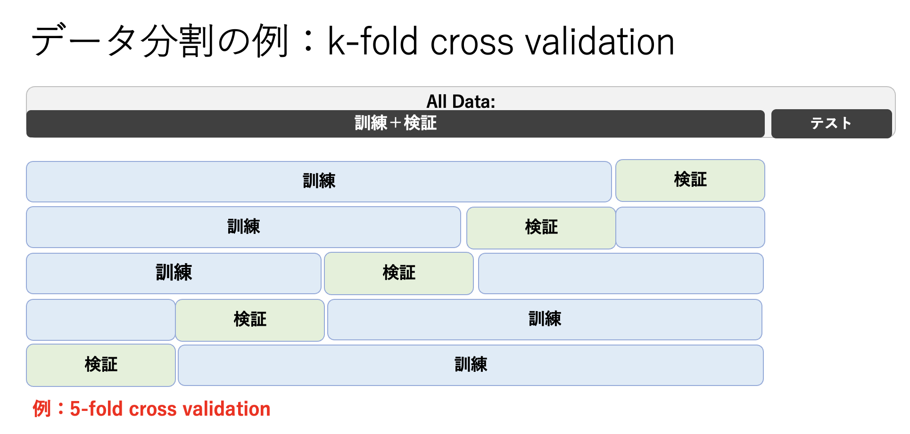

# モデル選択とベイズ線形回帰
## 超パラメータ（hyper parameter）
前回までに、最小二乗法（正則化最小二乗法）は、確率論的な枠組みとの対応の中で、最尤推定（事後分布最大化）に基づく一般化線形回帰とみなせるということがわかった。
簡単に言うと、事後分布$p(\vec{w}|\vec{t}, \vec{x}, \beta)$が、確率の乗法定理によって、
尤度関数$p(\vec{t}|\vec{x}, \vec{w}, \beta)$と事前分布$p(\vec{w}|\alpha)$の積に比例する

$$
p(\vec{w}|\vec{t}, \vec{x}, \beta) \propto p(\vec{t}|\vec{x}, \vec{w}, \beta) p(\vec{w})
\hspace{2mm}\cdots(1)
$$

という関係により、それを最大化するということが損失関数

$$
{\cal L}(\vec{w}) = \frac{\beta}{2}\sum_{n=1}^N \left( y(x_n) - t_n \right)^2 + \frac{\alpha}{2}|| \vec{w} ||^2 \hspace{2mm}\cdots(2)
$$

を最小化するということに一致するという事実を見てきた[*]。

**データ予測や$\vec{w}$の事前分布がガウス分布に従うという仮定が入っている*

両辺を$\beta$で割って正則化最小二乗法と比べると、$\lambda = \alpha/\beta$となり、
$\lambda$の値を適切な値に調整することで過学習が抑えられるということも、実際の演習を行うことで学んだ。

さて、式(2)の最小化で決まるのは$\vec{w}$であり、$\alpha,\beta$自体は決まらない。
どのように決めていたかというと、過学習が起こらないような結果になっているかを見て、
その時の$\alpha,\beta$の値（実際にはその比に対応する
$\lambda = \alpha/\beta$　）が適切であるということを正当化していた。手元にあるデータ全てを使ってフィッティングしているのであれば、それが過学習を引き起こしているかどうか一般的にはわからないことが多い。つまり、過学習が起こらないようにパラメータを決めるということは、答えを見て予測をしている（カンニングしている）ようなものと言え、もっと別な方法を本日の講義では考えてみたい。

ここで、事後分布最大化（損失関数の最小化）で決まらないパラメータを**超パラメータ (hyper parameter)**と呼ぶことにする。
そして、超パラメータの値を１つに選択することを**モデル選択**と呼び、これまで行ってきた一般化線形回帰において自由に値が取れる超パラメータ$\alpha,\beta$を、どのように決めるか（モデル選択するか）という問題に本章では踏み込んでいく。

ちなみに、モデル選択の問題は回帰だけでなく後半で学ぶ識別においても考えなければならない。しかし、以下に記すのと同じアプローチで識別問題も扱うことができることをここで付言しておく。


## モデル選択の方法1:データ分割
モデル選択で最も簡単かつ便利な方法は、データを「訓練」「検証」「テスト」用に分割し、超パラメータを変えて訓練データで学習された$\vec{w}$を持つモデルを多数用意した中で、検証データを最もよく再現する超パラメータを選択する（モデル選択する）という方法である。テストデータは、モデル選択までの一連の作業では一切使わない。これは最終的に選択されたモデルの予測精度（or誤差）を評価する際に使用する。

データ分割の仕方にも様々な方法がある。代表的な方法としてk交差検証（k-fold cross validation）がある（図4-1）。
これは予めテスト用のデータを除いておき、残りのデータをkグループに分割後、それぞれのグループを順次検証用に使う（残りは訓練に使う）ということを行う。この極端な例がLOO法（Leave-one-out method）であり、一個だけ検証用として使う（残りは訓練）。
LOOはとりわけデータ数が限られている場合によく使われる方法である（訓練にはなるべく沢山のデータを使いたいのである）。


{width=10cm}<br>
*図4-1. データ分割の例: 5-fold cross validationでは、訓練と検証を合わせたデータを５つのグループにわけ、そのうちの１つを検証、残りを訓練に使用する。*

グループにきちんと分けてしまうのではなく、データからランダムに検証用データをサンプリングする（残りは訓練データなので訓練データをサンプルする、という理解で良い）
という方法も考えられる。この場合はk交差検証と異なり訓練と検証のデータが重複しても良い（復元抽出）ようにもできる。これをブートストラップ法と呼んでいる。

事後分布最大化（正則化最小二乗法）に当てはめて考えてみよう。
まず、データから一部テスト用に取り出しておく。残りのデータからk交差検証やブートストラップ法によって訓練用と検証用にデータを分割し、抽出した訓練データで様々な$\lambda$に対してフィットされた$\vec{w}$を求める。検証データに当てはめた時、最も誤差が少ない$\lambda$（それに対応する最適解$\vec{w}$）を最適なモデルとして選ぶ。k交差検証やブートストラップ法ではこれが繰り返され、$\lambda$の平均値を最終的に選択されたモデルとみなす。

## モデル選択の方法2:ベイズのアプローチ
データ分割をせずに超パラメータを求める方法もある。これはベイズ線形回帰と呼ばれる方法で、データを無駄にせずにモデル作成にFullに使えるというメリットがある。ベイズ線形回帰は、$\vec{w}$の事後分布が得られていることが前提となる。
我々はまだ「事後分布を最大にする$\vec{w}$」しか求めていないので[*]、まずは事後分布である式(1)を求めてみよう。
ここで、事前分布と尤度関数が

$$
p(\vec{x}) = {\cal N}(\vec{x}|\vec{\mu}, \Lambda^{-1}) \hspace{2mm}\cdots(3)\\
p(\vec{y}|\vec{x}) = {\cal N}(\vec{y}|A\vec{x}+\vec{b}, L^{-1}) \hspace{2mm}\cdots(4)
$$

のようにガウス分布で書ける時、事後分布もまた

$$
p(\vec{x}|\vec{y}) = {\cal N}(\vec{x}|\Sigma(A^\top L(\vec{y}-\vec{b})), \Sigma), \hspace{2mm}where\hspace{1mm}\Sigma = (\Lambda + A^\top L A)^{-1}
\hspace{2mm}\cdots(5)
$$

とガウス分布になる。これを使って03「線形回帰モデルと正則化」のところで与えている線形回帰における尤度関数と事前分布、

$$
p(\vec{t}|\vec{x}, \vec{w}, \beta) = \prod_{n=1}^{N}{\cal N}(t_n|y(x_n,\vec{w}),\beta^{-1})
\hspace{2mm}\cdots(6)
$$

$$
p(\vec{w}|\alpha) = \left( \frac{\alpha}{\sqrt{2\pi}} \right)^{M/2}
\exp{(-\frac{\alpha}{2}\vec{w}^\top \vec{w})}
\hspace{2mm}\cdots(7)
$$

を当てはめると

$$
p_{prior}(\vec{w}|\alpha) = {\cal N}(\vec{w}|\vec{m}_N, \vec{S}_N)
\hspace{2mm}\cdots(8)
$$

$$
\vec{m}_N = \beta \vec{S}_N \Phi^\top \vec{t} 
\hspace{2mm}\cdots(9)
$$

$$
\vec{S}_N^{-1} = \alpha I + \beta \Phi^\top \Phi
\hspace{2mm}\cdots(10)
$$

となる。ここで$\Phi$は、これも「３線形回帰モデルと正則化」で与えている計画行列である。
（面倒な計算が入るのでここでは結果だけを示すが、皆さんであれば応用数学などで既に習っている代数を使うことでこのように書けることを証明できると思います。）

**練習１：**
式(8)を証明せよ。<br>
<br>
<br>
<br>
<br>
<br>
<br>
<br>
<br>
<br>
<br>


事後分布の具体的な形状がわかったので、ベイズ的な扱いに進んでいこう。ここでわかることは、今や求めたかった基底関数の重み付けを決定する$\vec{w}$はもはや１つの値ではなく、
**幅を持った分布となっている**という事実である。
事後分布最大化では、その分布で最も確からしいもの（点推定）だけを得て、それを使って予測（フィッティング）していた。しかしながら、今得られた結果は、確率は低くても、$\vec{w}$は点推定以外の値も取り得る、ということを示している。そうであるならば、分布を全て考慮して予測（フィッティング）してはどうか？これがベイズ線形回帰のいうところなのである。

$p_{prior}(\vec{w}|\alpha)$の確率とともに$t$を予測する（フィッティングする）というのは、$\vec{w}$は今や連続的なガウス分布になっているので、全ての取り得る可能な$\vec{w}$に対して
$p_{prior}(\vec{w}|\alpha)$という重みをつけた
積分、

$$
p(\vec{t}|\alpha, \beta) = \int p(\vec{t}|\vec{x}, \vec{w},\beta)p_{prior}(\vec{w}|\alpha)d\vec{w}
\hspace{2mm}\cdots(11)
$$

を実行するということである。この積分は解析的に解けないので、簡単のため、被積分関数で一番値が大きいところを一致させたガウス分布に近似し積分する（エビデンス近似という）。
すると、

$$
p(\vec{t}|\alpha, \beta) \sim \left(\frac{\beta}{2\pi}\right)^{N/2}
\left(\frac{\alpha}{2\pi}\right)^{M/2}
\exp{(-E(\vec{m}_N)} (2\pi)^{M/2} |S_N^{-1}|^{-1/2},
\hspace{2mm}\cdots(12)
$$
ここで、
$$
E(\vec{w}) = \frac{\beta}{2}||\vec{t}-\vec{\phi}^\top\vec{w}||^2+\frac{\alpha}{2}\vec{w}^\top\vec{w}
$$

となり、さらに対数をとると、

$$
\ln p(\vec{t}|\alpha, \beta) \sim 
\frac{M}{2}\ln \alpha
+\frac{N}{2}\ln \beta 
 -E(\vec{m}_N) (2\pi)^{M/2} 
-\frac{1}{2}\ln|S_N^{-1}|
-\frac{N}{2}\ln(2\pi)
\hspace{2mm}\cdots(13)
$$

となる。
手持ちのデータにおいて、これを最大にする$\alpha$と$\beta$を求めることで、先に見たような訓練用データと検証用データを分けることなしにモデル選択を行うことができる。ただし、陽な形では求まらないので、繰り返し演算（逐次演算）を行う；最初に適当な$\alpha$を与えて

$$
\gamma = \sum_i^M \frac{\lambda_i}{\alpha+\lambda_i}
\hspace{2mm}\cdots(14)
$$

を計算し、$\beta$も適当に与えて$\lambda=\alpha/\beta$を使ってその正則化のもとで$\vec{w}$を最適化する。今度はその最適化された$\vec{w}_{opt}=\vec{w}$を使って、

$$
\alpha = 
\frac{\gamma}
{\vec{w}^\top \vec{w}}
\hspace{2mm}\cdots(15)
$$

のように$\alpha$を更新する。$\beta$も

$$
\frac{1}{\beta} = \frac{1}{N-\gamma}\sum_n^N(\vec{w}_{opt}^\top\vec{\phi}(x_n)-t_n)^2
\hspace{2mm}\cdots(16)
$$

で更新する。こうして$\alpha$、$\beta$、$\vec{w}$が同じデータから最適解が得られる。

**練習2:**
* (1) k-fold cross validationに対するエビデンス近似によるモデル選択のメリット・デメリットを述べよ。
* (2) エビデンス近似における$\gamma$は有効パラメータ数と呼ばれる。それは何故か？（ヒント：**パラメータ**の意味しているところを明確にしましょう）

## pythonによるモデル選択
### データ分割による方法
regression_K-fold.pyを使う。
このスクリプトはgauss_direct_and_numerical.pyをベースに作られており、03（「線形回帰モデルと正則化」）の資料も見ながら理解を進めていこう。

main関数（70行目）までのところ（1行目~69行目）は、使用するライブラリや関数の定義が書かれている。

まずk_basisで使用する基底関数（gaussかpolynomial）を指定する。続いてデータを入力する。k-fold.csvを用意しているので、それをダウンロードして読み込むようにする。そのデータをプロットしてみよう。これは全部で100点のデータである。


次にデータ分割を行う。
```py
for k in range(kf):
    df_valid = df_all[k::kf]  # k-fold
    #df_valid = df.sample(kf) # random sampling ランダムにサンプルする場合、こちらを使用
    df = df_all.drop(df_valid.index) #df_valid以外の残りをdfとする
```
kfは分割するグループの数で、defaultでは5に設定してある。つまり100点のデータでは訓練に80個、検証に20個のデータを使う。df_all[k::kf]はスタート行kからkf置きに行を取り出すという意味である。これによってどのようにdf_allのデータがdf_validとdfに振り分けられるか、printで出力して確認しておくこと。


基底関数の設定（今回は10次の多項式を使う）し、最適化を行う。
分割したデータのうち、dfを使って$\vec{w}$を最適化するが、
その際に超パラメータlambの値を指定しなければならない。
ここでは、lambを初期値1として0.8を繰り返し掛けて値を小さくしていく中で、フィットされたモデルがdf_validにあるデータを最もよく再現するところを見つけてみよう[*]

*このように、ある数値の範囲を適度な間隔で網羅的にサーチする手法をグリッドサーチ（grid search）という。*


```py
for L in range(100):
    w = np.zeros(num_basis)
    lamb *= 0.8
    direct_w = direct_weight_optimize(y_true,basis,lamb)
```

これで順次変更したlambの値に応じて最適化された$\vec{w}$がdirect_wに格納される。

**練習１：**
サーチするlambの範囲を求めよ。何回0.8倍する？
<br>
<br>
<br>

次に5つの検証データでフィットされたモデルの精度を確認する。
```py
x = df_valid["x"] 
y = df_valid["total"]
if k_basis == "gauss":
    basis_valid = gauss_basis_set_calc(num_basis,x,mu,sigma)
elif k_basis == "polynomial":
    basis_valid = basis_set_calc(num_basis,x)
fitted = np.dot(direct_w,basis_valid)
mse_value = mean_squared_error(fitted, y)
if mse_value < min_mse:
    min_lamb = lamb
    min_mse = mse_value
```

min_mseに最小となる二乗和誤差、min_lambにその時のlambの値が格納される。5分割検証によって得られる5つのlambの値は
その次の行にあるdata_min_lambに入れられ、その平均値を使って全体のデータで最終的なモデルを作成する（151, 152行）。

この最終モデルを、潜在的な答えであるsin関数と比べて性能を測ってみよう（一般化できるかどうか？汎用性があるか？$\rightarrow$汎化性能を調べる）。156行目以下は、モデルの関数とsin関数の同時プロットと、図の中にsin関数とのRMSEを示すためのコードである。


**練習２：**
10交差検証を実施し、5交差検証の結果と比較せよ。
<br>
<br>
<br>
<br>

### エビデンス近似による方法
次にエビデンス近似によって超パラメータを決定し、そのモデルによるデータフィッティングの汎化性能を求めて上の結果と比較してみよう。
regression_Evidence.pyを用いる。またデータも同じk-fold.csvである。
使用する基底関数も同じ10次の多項式とする。
111行目まではほとんど同じ。次に計画行列の積（$\Phi^{\top}\Phi$）の固有値を求める。
```py
# eigen value 固有値を求める
eig , eig_vec = LA.eig(np.dot(basis , basis.T))  
# initial value
alpha = 0.0001
beta = 1
# max num. of iteration
num = 20
```
alphaとbetaの初期値を与え、繰り返しながらデータにフィットするように更新する（ここでは20回更新）。
式(15)-(16)を20回繰り返す。
```py
for ite in range(num):
    gam = np.sum(eig/(alpha/beta+eig))
    direct_w = direct_weight_optimize(y_true,basis,alpha/beta)
    mTm = np.dot(direct_w.T , direct_w)
    alpha = gam / mTm
    fitted = np.dot(direct_w,basis)
    beta = (len(y_true)-gam)
    mean_squared_error(fitted, y_true)
    print(alpha, beta, gam, mTm)
```
最後にsin関数と比べて性能を測る。

$\vec{w}$の予測分布は確率的であるため、よって$\vec{w}$がある範囲で分布している。そのため、$t$の予測値も確率的となる。つまり、$t$の予測範囲も標準誤差の範囲で描かせることができる。そのプロットも表示される（説明略）。


## 演習レポート
* (1) k-fold.csvのデータに対してのデータ分割の方法とエビデンス近似の方法によるモデル選択の結果を比べよ。
* (2) 両者が一致しないのはなぜか？そもそも一致する条件はあるか？
* (3) どちらが優れた方法か？条件によってデータ分割またはエビデンス近似の方が優れている、というように変わることがあるか？
