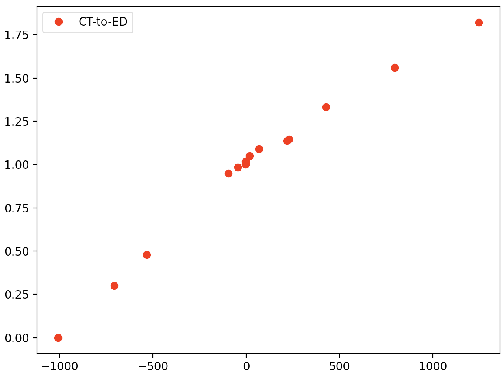

# 最小二乗法と最尤推定

## はじめに 

機械学習や人工知能を学ぶ上で、実現したいことに対して手法を分けて整理しておくと理解が進むことがある。基本的に、我々が機械学習や人工知能を使って実現したいことは「回帰・識別・クラスタリング」である（図2-1）（この他に将棋ソフトのような「強化学習」というものもある。これは勝利に導いた「過程」に報酬を与えることで何度も対戦を繰り返すことで報酬が最大になる経路を学習していくというプロセスを踏んでいる。「報酬の最大化」という点を見ると、これから行う回帰や識別・クラスタリングと同じような問題設定に帰結させていることに気づくであろう）。**回帰（Regression）** は量的データ（数値であり、値の大小が意味をなすもの）を再現することが目的であり、関数フィッティング（または単にフィッティング）のことである。**識別（Classification** は量的データ[*]を情報として質的データ（男女、犬猫、のように大小の意味を持たないもの）を分ける境界を引くことに対応し、**クラスタリング（Clustering）** は識別に似ているが、識別のように分けたい質的データを最初から与えるのではなく、量的データから似たもの同士をグループ化する（クラスタリングする）ことを行う。識別は、量的データを入力として質的データを学習するが、クラスタリングは、質的データの学習が必要ないため、前者を**教師あり学習**、後者を**教師なし学習**として区別している。

**質的データと量的データについては医学統計学で学ぶ*

{width=10cm}<br>
*図2-1:機械学習・人工知能で実現させること：回帰・識別・クラスタリング*

医用データ科学Iでは、前半で回帰、後半で識別を学ぶ。
回帰は先に述べた通り、数値データをフィッティングすることである。最も簡単な例は、一次元データを直線でフィッティングすることであり、全く同じ枠組みで曲線でフィッティングしたり、多次元データに当てはめることが可能である（図2-2）。
これらが同じ枠組みで理解されるということが実感できた時、回帰がマスターできたと言えるとともに、どのようなデータに対しても立ち向かえることができる武器を手に入れたことになる。
本稿では、まず最小二乗法によってなぜ一次元データをフィッティングすることができるのかを学び、
この最小二乗法が俯瞰的に見ると、データにガウス型ノイズが付加されていると考えた時の最尤推定によって導かれることを学ぶ。

{width=10cm}<br>
*図2-2:左：直線フィッティング、中央：曲線フィッティング、右：二次元データのフィッティング。どれも回帰という機械学習の枠組みで実現される。*

## 最小二乗法

図2-3に示す赤の丸点を直線でフィッティングすることを考えよう。
これは横軸をCT値[Hunsfield Unit], 縦軸を水に対する相対密度としたCT値密度変換データである。
直線でフィッティングすることで、任意のCT値を相対密度に変換することができる。
赤のデータ点を$(x_n, t_n)$と記述することにしよう。ここで$x_n$がデータ点のCT値、$t_n$が対応するデータ点の相対密度である。
今CT値を$x$としたときに相対密度を与える直線として$y=ax+b$を仮定する。
データフィッティングの問題は、「データを再現する関数$y=ax+b$の$a,b$を求める」という問題と見做せる。
「データを再現する」ということを数式上で表現するには、それを「データ点と直線との距離が最も短くなる」と読み替えることで、

$${\cal L} = \frac{1}{2}\sum_n^N (y(x_n)-t_n)^2 = \frac{1}{2}\sum_n^N ((ax_n+b)-t_n)^2 \hspace{2mm}\cdots(1)$$

を最小にする$a,b$を求めれば良いのではないか、と考えることができよう（1/2は偏微分する際に消えるので便利のためつけている）。
この式はデータ点と直線の二乗和であり、これを最小にしようとするため、最小二乗法という名前が付けられている。


<!------>
{width=7cm}<br>
*図2-3:CT値密度変換データ：横軸はCT値[Hunsfield Unit], 縦軸は水に対する相対密度。
このグラフから、ある人に頭部のCTを撮影した時の脳幹の密度を推定するにはどうすれば良いだろうか？*

**練習１:**
式（1）を$a$と$b$で偏微分した結果を示せ。
<br>
<br>
<br>
<br>
<br>
<br>
<br>


**練習2:**
この偏微分の結果を用いて図2-4の三点のデータに対する直線フィッティングの式$y=ax+b$を求めよ。

<!------>
<br>
*図2-4:3点との差が最も小さくなる直線を求めよ（応用数学Iでやってますよ！）*
<br>
<br>
<br>
<br>
<br>
<br>
<br>


ここまでは直線フィッティングを考えてきたが、それはフィッティングの関数を直線と仮定したからであり、
別にどのような関数を用意しても最小二乗法を行うことができる。例えば多項式、

$$
y(x) = \sum_{i=0}^{M}w_i x^i = w_0 + w_1 x + w_2 x^2 \cdots + w_M x^M \hspace{2mm}\cdots(2)
$$
でフィッティングすることを考えてみよう。これを式(1)に代入して求めたい$w_i$で偏微分し、それが0となる$w_i$を求めれば良いわけである。
実際にやってみよう。今後のことも考えて上式を、

$$
y(x) = \sum_{i=0}^{M}w_i \phi_i(x) = w_0 + w_1 \phi_1(x) + w_2 \phi_2(x) \cdots + w_M \phi_M(x) = \vec{w}^{\top}\vec{\phi}(x) \hspace{2mm}\cdots(3)
$$
としておく。つまり$\phi_i=x^i$とすれば多項式になるので、(3)は(2)を一般化したことになる。

これで二乗和誤差関数

$$
{\cal L}(\vec{w}) = \frac{1}{2}\sum_{n=1}^N \left( y(x_n) - t_n \right)^2 \hspace{2mm}\cdots(4)
$$
を$w_i$で偏微分し、0とおいて整理すると次の解析解が得られる。

$$
\vec{w} = \left(
\Phi^\top\Phi
\right)^{-1}
\Phi^\top \vec{t} \hspace{2mm}\cdots(5)
$$

ここで計画行列$\Phi$は

$$
\Phi =
\begin{pmatrix}
\hspace{2mm}1 & \phi_1(x_1) & \cdots & \phi_M(x_1)\\
\hspace{2mm}1 & \phi_1(x_2) & \cdots & \phi_M(x_2)\\
 & \cdots & \\
\hspace{2mm}1 & \phi_1(x_n) & \cdots & \phi_M(x_n)\\
\end{pmatrix} \hspace{2mm}\cdots(6)
$$
のように書ける。

**練習3:**
式（5）を導け。


ここまでで、素晴らしいことに気づく。式(3)-(6)を見るとおり、この結果は関数の選び方やその数によらない形で得られているという事実である。関数に複雑な形をした関数を選べば、フィッティングも複雑なデータに対応でき、応用範囲が広がりそうである。にも関わらず、(2)のような多項式であろうともっと複雑な関数セットを選ぼうと(5)のような形で得られてしまうのは何故か？それは仮定したフィッティング関数式(3)が**求めたいパラメータ$\vec{w}$に対して線形**であるからである。
どんな関数を用意しても、その重み$w_i$の調整で線形和（重ね合わせ）で表現してしまえば、結論は同じになる。これはすごいことだ!
もちろん、限界も現れる。それは和の数には限りがあることに起因したり、適切な関数の選択をどうすれば良いのかが職人芸になる、といった点である。
そのような課題にどのように立ち向かうのか、それは後半の講義で少しずつ明らかになろう。


## 最小二乗法の別の見方：最尤推定
データフィッティングを、データ点とフィッティング関数の誤差の二乗が最小になるという観点でこれまで定式化してきた。
これを確率的な観点から眺め、最小二乗法の背景にある理論とその拡張に見通しをつけるために、同じ結論に至る最尤推定をここで学ぶ。

データフィッティングの目標は、$N$個のデータ$(x_n, t_n), n=1\sim N$に基づいて、新たなデータ$x$に対する$t$を予測する、というように見ることができる。
目標とする$t$の予測の不確実性は、確率分布をつかって表すことができる。与えられた$x$に対する$t$は、平均がフィッティング関数$y$となるガウス関数に従うものと仮定する。
$$
p(t|x, \vec{w}, \beta) = {\cal N}(t|y(x,\vec{w}),\beta^{-1}) \hspace{2mm}\cdots(7)
$$
ここで${\cal N}(t|\mu,\sigma) = \frac{1}{\sqrt{2\pi\sigma^2}}\exp{(\frac{1}{2\sigma^2}(t-\mu)^2)}$
は変数が$t$, 平均が$\mu$, 標準偏差が$\sigma$のガウス分布（正規分布）を表す。
訓練データ$(x_n, t_n), n=1\sim N$ = ($\vec{x}, \vec{t}$)を使って$\vec{w}$と$\beta$を求める方法に最尤推定がある。
これは、観測されたデータ ($\vec{x}, \vec{t}$)が得られる確率（尤度）が、それぞれの観測が独立の時、
$$
p(\vec{t}|\vec{x}, \vec{w}, \beta) = \prod_{n=1}^{N}{\cal N}(t_n|y(x_n,\vec{w}),\beta^{-1}) \hspace{2mm}\cdots(8)
$$
となるので、この尤度を最大にする$\vec{w}$と$\beta$を求める、と考えることができるからである。
では、尤度の最大化を考えてみよう。その前に式(\ref{eq8})の対数をとる。これは対数は単調関数のため、最大値を与える変数$\vec{w}$と$\beta$の位置を変えないことを利用する。
対数をとると、
$$
\ln p(\vec{t}|\vec{x}, \vec{w}, \beta) = -\frac{\beta}{2}\sum_{n=1}^N \left( y(x_n) - t_n \right)^2 + \frac{N}{2} \ln \beta - \frac{N}{2} \ln (2\pi)
\hspace{2mm}\cdots(9)
$$
となる。この関数を$\vec{w}$の関数とみなした時、右辺の第二項と第三項は除いて良い（実際に偏微分すると0になる）。
式(4)と見比べると、前にかかる$\beta$と符号が異なるが、$\beta$は最大にする$\vec{w}$の値を変えず、
また、符号は最大化と最小化の違いであることから、
**尤度関数式(8)を最大にする最尤推定の手法は、最小二乗法と全く同じフィッティング結果を与える**。

**練習4:**
式（9）を導け。
<br>
<br>
<br>
<br>
<br>

## pythonを使った最小二乗法

### グラフ表示
CT-to-ED.csvをダウンロードし、グラフを表示させてみよう。
（参考）以下では、前回作成したinput_output.pyを編集して、
output.csvのデータをグラフ表示するスクリプトを作成します。

```py
import pandas as pd
import matplotlib.pyplot as plt
# データの読み込み
df = pd.read_csv("output.csv", encoding="SHIFT-JIS")
print(df)
# 2列目と3列目の和をとり、新たにtotalという項目名で4列目を作る
df["total"] = df["sin_2px"]+df["noise"]
print(df)
# データの出力（今回はコメントアウト）
#df.to_csv("output2.csv", index=None, encoding="SHIFT-JIS")
# 図の作成 \\
plt.plot(df["x"], df["sin_2px"], ls="-", color="red", label="sin_2px") #折れ線 
plt.scatter(df["x"], df["total"], marker="o", color="blue",label="total") #散布図 
plt.xlim(-0.1,1.0) # xの範囲
plt.ylim(-1.5,1.5) # yの範囲
plt.legend() # レジェンドを追加
plt.tight_layout() # レイアウトの自動調整（常に書いておく）
plt.show()  # 図の出力
```

**練習１：**
作成したスクリプトを編集し、
CT-to-ED.csvの１列目（CT_value_1）をx軸、
3列目（Physical_Density）をy軸にとった散布図と
2列目（CT_value_2）をx軸、
3列目（Physical_Density）をy軸にとった散布図を重ねたグラフを作成せよ。
<br>
<br>

### 最小二乗法：直線フィッティング
まずは、見た目で$y=ax+b$を使って図のデータ点をなるべく通るような$a$と$b$を探してみよう。データを読み込んだ後に、下に示す部分をスクリプトに記載することで、直線を一緒にプロットすることができる。
```py
x = [-1000, 1300]
y = [0.2,1.7]
a = (y[1]-y[0])/(x[1]-x[0])
b = y[1]-a*x[1]
print("y=",a,"x+",b)
plt.plot(x, y, ls="-", label="fitting")
```
（ここで何をやったのか、各自考えて理解すること）<br>
直線がちょっと合っていないようなので、上を修正して自分なりに合わせるように調整してみよう。

ここでやったことは、「見た目で合わせる」という作業である。
これは科学的な根拠に基づいた合わせ方ではないが、やってダメなことでは決してありません。
フィッティングの感触を掴む時にはむしろ直感的な方法を試してみるということは「有効な発想」です。一方、大学生なら最終的にはもっと明確で定量的な指標とともにフィッティングしてもらいたいものであるのも事実です。
最小二乗法を使った直線フィッティングは、フィッティング関数を$y=ax+b$とした時に、
<u>データとの誤差${\cal L}(a,b)=\sum_n (y_n-t_n)^2$を最小にする$a$と$b$を見つける</u>、という作業をすることでした。これを使うことで、明確で定量的なフィッティングができそうです。
この誤差の最小値を求める問題は、$a$と$b$で偏微分してそれが$=0$となる時の$(a, b)$を求めれば良い。では、そのようにして
CT_valueを説明変数（$x$）としてPhysical_Density（$t$）をフィットするにはどうしたら良いのか？


今回はpythonが用意している数値計算用の「ライブラリ（library）」を利用して解いてみることにする（後の講義では、式(5)を自分で作成してもらうことも行います）。pythonはこれまでの歴史で積み上げられてきた様々な科学技術計算のライブラリを有しており、それを利用することで上記のような面倒な計算を簡便に行うメソッドを提供してくれている。最小二乗法のためのライブラリもいくつか用意されている；
* Numpy の polyfit
* Scipy の optimize.leastsq
* Scipy の optimize.curve_fit

などなど。ここではNumpyのpolyfit（多項式フィット）を使ってフィッティングしてみよう。まずNumpyを使うため、それをimportする。

```py
import numpy as np 
```
（Numpyを使うためにはこれを予め宣言しておく必要がある）。

そして、以下をスクリプトの適切なところに書き込もう。
```py
# Least mean square fitting
coef = np.polyfit(df["CT_value_1"],df["Physical_Density"],1) 
y_pred = coef[0]*df["CT_value_1"]+ coef[1] 
plt.plot(df["CT_value_1"], y_pred, ls="-", color="black",label="fitting_LMS") 
print("y=",coef[0],"x+",coef[1]) 
```
ここで書かれた内容をスクリプトに追加することで、どのような出力が出るだろうか？１行ずつ何をしているかを自分の頭でしっかり考えること。みなさんなら、理解できるはず。


**練習２：**
np.polyfitを使った結果と目で合わせた結果をグラフ上で比較せよ。目で合わせたフィットと比べ、どちらが良い？
<br>
<br>
<br>

### 最小二乗法：多項式フィッティング
今度はoutput2.csvの１列目（x）と４列目（total）をフィットしてみよう。np.polyfitを早速使ってフィッティングしてみると…

**練習３：**
output2.csvの１列目（x）をx、
４列目（total）をyとして、フィッティングせよ。
<br>
<br>
<br>

いかがでしょう。フィットは成功しましたか？
うまくできない人は、以下をヒントに考えてみてよう。
```py
# Least mean square fitting
coef = np.polyfit(df["CT_value_1"],df["Physical_Density"],4) 
```

ここで赤字で示した4は４次の多項式（$y=a+bx+cx^2+dx^3+ex^4$）を用いるということを意味する
（前節ではここを１にしていたので直線近似していたことになる）。
４次式をプロットしてみよう。まず多項式でフィットされた結果を出力する。その際、滑らかな曲線で表示したいので以下の作業により$x$のデータを細かくしておく。

```py
# Least mean square fitting 
coef = np.polyfit(df["x"],df["total"],4) 
x = np.arange(0,1.01,0.01) #表示するxを細かくする
y_pred = coef[0]*x*x*x*x + coef[1]*x*x*x + coef[2]*x*x + coef[3]*x + coef[4] 
plt.plot(x, y_pred, ls="-", color="black",label="fitting_LMS")
```
フィットできましたか？できた場合でも、疑問があればなぜできたのかをきちんと説明できるよう、疑問点を解消しましょう。

さて、多項式の数を変えるたびにy_predの形を次数に対応して変えなかればならないのは面倒だ。10次の多項式なんて、想像するだけで嫌ですね。np.polyfitに関して多項式の数に応じて計算してくれる関数funcを次のように作ることができる。
```py
# Least mean square fitting
x = np.arange(0,1.01,0.01) #表示するxを細かくする
func = np.poly1d(np.polyfit(df["x"], df["total"], 4)) #4次の多項式関数を作成
plt.plot(x, func(x), ls="-", color="black",label="fitting_LMS") #func(x)でOK
```
出力されましたね！np.poly1dを使うことで、np.polyfitでフィットして決まった係数$w$を使って任意の$x$で値を返す関数を作ることができています。

次に10次の多項式フィッティングをやってみよう。
結果はいかがでしたか？

<!---
%問1：4次と10次の違いが生じた理由を考えよ。\\
%\vspace{1.5cm}
%df <- transform(data2, PredictedY = predict(poly.fit))
%plot(df$x,df$PredictedY)

%fm3=nls(y+rdat~a+b*x+c*x^2+d*x^3,start=c(a=1,b=1,c=1,d=1),trace=T) 
%plot(x,fitted(fm3),col=4)
%\section{分類}
--->

今みなさんは、<u>過学習</u>という問題を目の当たりにしています。10次多項式のフィッティングで生じたこの問題の解決方法は、次週以降で探りたいと思います。

## 演習レポート
4次と10次の違いが生じた理由を考え、<u>解説</u>せよ。