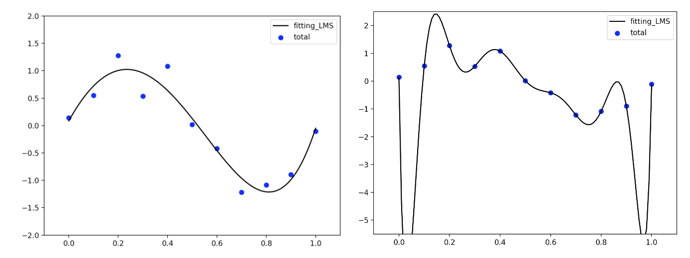

# 過学習と正則化
最小二乗法によるフィッティングをもう一度見てみよう。

**復習１:**
output2.csvの"total"を$x$の4次及び10次の多項式でフィッティングせよ。

{width=10cm}<br>

この図の青丸のデータは、$\sin(x)$に少しノイズを入れて作られた人工データである。
4次の多項式フィッティングでそこそこの結果が得られるが、多項式の項の数を増やすとさらにデータを完璧に再現することができるようになることがわかる。
しかし、データを生み出しているはずの$\sin(x)$とは似ても似つかない形になった。これは実は困ることである。何故なら、通常のデータにはノイズが含まれており、知りたいのはノイズを除いた真の値（今の場合は$\sin(x)$）であるからである。多項式の項の数を増やすというアプローチは、データを再現するのに直感的に重要と思われるのにどうしてこのようなことになったのであろう？
これはデータ点の数（11個）に対して、フィッティングするパラメータが多くなることによって（10次の場合は定数項を含めて11個の変数）データを再現するようにパラメータの値がかっちり決まってしまうのが原因であると考えられる。データ点以外のところはどうでもよく、データ点のみ再現できていれば良い、という問題であればこれで構わないが、機械学習や人工知能ではこれは問題である。機械学習や人工知能では、***データ点を再現するパラメータを求めるとともに、データ点がないところも尤もらしい値を予測する***ことに主眼を置くからである。

10次の多項式による結果をみよう（上右の図）。
データ点以外のところはめちゃくちゃである。このモデル（$y=\sum_{i=0}^{10}w_i x^i$）は、データ点の再現に成功していても、予測性能としては非常に貧弱である、と言わざるを得ない。
以上の結果は、<u>過学習</u>の代表的な例である。以下ではまず、過学習を避ける方法として正則化によるアプローチを学ぶ。
そして、この正則化という手法が、確率論的な観点では最尤推定から事後分布最大化、さらにはベイズ線形回帰という手法に密接に関係していることを今回と次々回の講義で、目の当たりにする。


## 一般化線形回帰と正則化
前回の資料で、フィッティング関数を一般化し、

$$
y(x) = \sum_{i=0}^{M}w_i \phi_i(x) = w_0 + w_1 \phi_1(x) + w_2 \phi_2(x) \cdots + w_M \phi_M(x) = \vec{w}^{\top}\vec{\phi}(x)
\hspace{2mm}\cdots(1)
$$

という関数でデータを最小二乗フィッティングするときを考えると、右辺のそれぞれの関数$\vec{\phi}(x)$
（これを**基底関数**と呼ぶ）にかかる重み$\vec{w}$を求める問題として、

$$
\vec{w} = \left(
\Phi^\top\Phi
\right)^{-1}
\Phi^\top \vec{t} \hspace{2mm}\cdots(2)
$$

ここで計画行列$\Phi$は

$$
\Phi =
\begin{pmatrix}
\hspace{2mm}1 & \phi_1(x_1) & \cdots & \phi_M(x_1)\\
\hspace{2mm}1 & \phi_1(x_2) & \cdots & \phi_M(x_2)\\
 & \cdots & \\
\hspace{2mm}1 & \phi_1(x_n) & \cdots & \phi_M(x_n)\\
\end{pmatrix} \hspace{2mm}\cdots(3)
$$

のように書けることを学んだ。
また、これは最尤推定でも同じことであることを知った。
ここで$\vec{\phi}(x)$はどのような関数でもよい。この一般化された回帰モデルを**一般化線形回帰モデル**と呼ぶ。「線形」というのは、式(1)を$\vec{w}$の関数として眺めた時、これが線形表現（$w$の一次関数）になっているからである（元々知りたいのは$\vec{w}$である）。では、この表現を使いながら、正則化を説明していこう。

## 正則化項（制約項 or ペナルティ項）
過学習の現象を制御するためによく使われるテクニックの一つに正則化（regularization）と言われる方法がある。これは$t$をデータとして誤差関数、

$$
{\cal L}(\vec{w}) = \frac{1}{2}\sum_{n=1}^N \left( y(x_n, \vec{w}) - t_n \right)^2 \hspace{2mm}\cdots(4)
$$

に罰則項（penalty term）

$$
\frac{\lambda}{2}|| \vec{w} ||_2^2 
= w_0^2 + w_1^2 +\cdots +w_M^2 
\hspace{2mm}\cdots(5)
$$

を付加することによりフィッティング・パラメータである$\vec{w}$の大きさを制御するという方法である（$|| \hspace{2mm} ||_2$をL2ノルムと呼ぶ）。つまり、

$$
\tilde{E}(\vec{w}) = \frac{1}{2}\sum_{n=1}^N \left( y(x_n, \vec{w}) - t_n \right)^2 + \frac{\lambda}{2}|| \vec{w} ||_2^2
\hspace{2mm}\cdots(6)
$$

を最小にする$\vec{w}$を見つける、という最小化問題を解くことを行う。
ここで$\lambda$は正則化項と二乗和誤差の相対的な重要度を調整する超パラメータ（hyper parameter）である。
$\lambda$が大きいと、$\vec{w}$をなるべく小さくするようにしてデータをフィッティングし、逆に$\lambda$を小さくすると、最小二乗法の結果に近づいていく。


正則化項を入れて回帰を行うには、式（6）を最小にしなければならない。
最小値を求めるには$\vec{w}$で偏微分し、それが0となる停留点を求めれば良い。
では、式（6）を偏微分してみよう。


**練習１**:
式（6）を$\omega_j$で偏微分した結果を示せ。
<br>
<br>
<br>
<br>
<br>
<br>
<br>
<br>
<br>
<br>
<br>
<br>
<br>
<br>
<br>
<br>

以上より、式（6）を最小にする$\vec{w}$は次のように書ける；
$$
\vec{w} = \left(
\lambda I + \Phi^\top \Phi
\right)^{-1}
\Phi^\top \vec{t}
\hspace{2mm}\cdots(7)
$$
ここで$I$は単位行列である。$\Phi$は計画行列と呼ばれ、次の形に書ける（これは後ほどpythonで演習するときのdirect_optimize.pyやdirect_and_numerical.pyで使われているbasisに対応するが、それぞれ転置の関係にある（$\rightarrow$ basis = $\Phi^\top$, basis.T = $\Phi$）ことに注意）；
$$
\Phi =
\begin{pmatrix}
\hspace{2mm}1 & \phi_1(x_1) & \cdots & \phi_{M}(x_1)\\
\hspace{2mm}1 & \phi_1(x_2) & \cdots & \phi_{M}(x_2)\\
 & \cdots & \\
\hspace{2mm}1 & \phi_1(x_n) & \cdots & \phi_{M}(x_n)\\
\end{pmatrix} \hspace{2mm}\cdots(8)
$$

さて、式（7）の右辺は全てわかるので、これで求めたかった$\vec{w}$が得られたことになり、
正則化最小二乗法によるフィッティングの結果は
$$
y(x, \vec{w}) = \sum_{i=0}^{M}w_i \phi_i(x) = w_0 + w_1\phi_1(x) + w_2 \phi_2(x) \cdots + w_M \phi_M(x)\hspace{2mm}\cdots(9)
$$
で得られたことになる。


これをプログラムで求めることが次回の演習でのお題である。式（7）で$\lambda=0$とおいた結果が以前に行った最小二乗法であり、その時はnp.polyfitというライブラリを利用した。式（7）を見ると、$\lambda$があるかないかはちょっとした違いなのでnp.polyfitで計算できそうだが、そうは問屋が卸さない。np.polyfitは、正則化に対応していないのである。
このように、**たかが正則化項**が加わるだけで対応できなくなってしまうのも困る。
もっと一般的に考えてみると、最小にしたい関数を二乗和誤差から変更したい時にはどうすれば良いのか？
（データを当てはめる方法には様々な方法があり、二乗和誤差を最小にするのが唯一の方法ではない！）

次回は正則化一般化線形回帰モデルのプログラムを２つ作成する。
1つは式（7）をそのまま用いて解くプログラム、もう一つは関数の最小値を求めるpythonのライブラリscipy.optimizeを使ったプログラムである。
作成すると言っても、全部を１から作るというわけではなく、損失関数である式（6）を自由に変えられるようにし、その最小値とそれを与える$\vec{w}$を求める汎用性の高いプログラムを、上手くライブラリを使いながら作成してみたいと思う。


## pythonによる正則化一般化線形回帰モデル
### 一般化線形回帰のプログラミング1
output2.csvの項目totalに対して正則化最小二乗法で<u>式（7）を使って</u>フィットするプログラムを作成する。


(1) データoutput2.csvを読み込む
```py
df = pd.read_csv("output2.csv", encoding="SHIFT-JIS") 
```
(2) パラメータの設定（多項式の数と$\lambda$）
```py
num_basis = 10 
num_basis += 1 
lamb = np.double(0.0005)
```
2行目で$+1$をしたのは定数項を加えるため（10次の多項式の決めたい重みは10+1個ある）
**lambが式(\ref{regular})に対応する正則化の重みである**（式(15)における$\alpha/\beta$）。

(3) 多項式基底の作成（前回やった関数オブジェクトを使ってみましょう）
```py
basis = basis_set_calc(num_basis,df["x"])
```
ここで、basis_set_calcは次のように定義しておきます
```py
def basis_set_calc(num_basis, x_n): 
    # set basis function
    for idata in range(0,num_basis):
        if idata == 0:
            basis = x_n**idata
        else:
            basis = np.append(basis, x_n**idata, axis=0)
    basis = np.reshape(basis, (num_basis, len(x_n)))
    return basis 
```
(4) フィットするデータと$\vec{\omega}$を用意
```py
y_true = df["total"]
w = np.zeros(num_basis)
```
(5) 式（7）を使って重みを求める
```py
def direct_weight_optimize(y, basis, lamb):
    prevec = np.dot(basis, y)
    premat = np.linalg.inv(lamb * np.identity(len(prevec)) + np.dot(basis,basis.T))
    ww = np.dot(premat,prevec)
    return ww
```
(6)結果を出力させる。図を出力させるとうまくいったかどうかを判定しやすい。
```py
plt.plot(df["x"],y_true, "ro", label="data")
x = np.linspace(0, 1, 100)
plt.plot(x,np.sin(2*np.pi*x), label="true")
basis = basis_set_calc(num_basis,x)
fitted_2 = np.dot(direct_w,basis)
plt.plot(x,fitted_2, label="predict", color="green")
rmse = "rmse = %f" % mean_squared_error(fitted_2, np.sin(2*np.pi*x))
plt.text(0.6,0.5, rmse)
plt.legend()
plt.show(block=True)
```
(7) 一連のプログラムを実行するのに必要なライブラリのインポート
```py
import numpy as np
import pandas as pd
import math
import matplotlib.pyplot as plt
import sys
from scipy.optimize import minimize
from sklearn.metrics import mean_squared_error
```

これをつなぎ合わせて作られているのが
direct_optimize.py
です。関数の呼び出し方に注意しながらプログラムを読んでください。

### 演習レポート1
(1) lamb = 0と0.0005にした時の多項式を1, 4, 10とした時の結果を示し、考察せよ。<br>
(2) lambは、どのようにして決定するのが望ましいか？


### 一般化線形回帰のプログラミング2
output2.csvの項目totalに対して正則化最小二乗法で
今度は<u>数値的に</u>フィットするプログラムを作成する。
(1) - (4) までは同じ
```py
y_true = df["total"]
w = np.zeros(num_basis)
```
(5) 最小化
```py
result = minimize(objectivefunction, x0=w, args=(y_true, df["x"], basis, lamb), jac=gradient, tol=10**(-10), method='SLSQP')
```
ここで最小化したい関数をobjectivefunction、そのパラメータ$\omega$に対する偏微分をgradientとしており、
それぞれ次のようにオブジェクトとして定義する。

objectfunction: 
```py
def objectivefunction(w, y, x, basis, lamb):
    y_pre = np.dot(w, basis)
    oval = 0.5*np.sum(np.square(y - y_pre))
    penalty = 0.5*lamb*np.sum(np.square(w))
    return oval + penalty
```
gradient:
```py
def gradient(w, y, x, basis, lamb):
    premat = np.dot(basis,basis.T)
    g_pre = (np.dot(premat,w) - np.dot(basis,y))
    g_penalty = lamb * w
    grad = g_pre + g_penalty
    return grad
```
(6)-(7)は基本的に前と同じ。
前の節で作ったプログラムと合わせて作られているのが
direct_and_numerical.py
である。
関数の呼び出し方の違いに注意。何をやっているかわかりますか？
(5)のminimizeを使った最適化については、講義中に使い方の説明をします（[minimize](https://docs.scipy.org/doc/scipy/reference/generated/scipy.optimize.minimize.html)参照）。

**練習1：**
direct_optimize.pyとdirect_and_numerical.pyのフィッティング結果を比べよ。

### 基底関数の選択
これまでは基底関数に多項式を使ってきたが、一般化線形回帰の枠組みは、$\vec{w}$を求めるという観点では基底関数はなんでも良いということだったので、
基底関数さえ変えるところを用意できれば、あとは**同じプログラムが利用できる**。
それでは基底関数を多項式（$1, x, x^2, \cdots, x^M$）から別の関数に変えてみよう。
基底関数はなんでも良いのだが、数少ないパラメータで局在性をコントロールできる、微積分が容易など、性質の良い関数を使うと汎用性が高く便利になる。
ここでは２つのパラメータ（平均値と標準偏差）で局在性をコントロールできるガウス関数を使ってみよう。
$\phi_j (x_i)$を次のように設定する。
$$
\phi_j (x_i) = \exp\left(-\frac{(x_n-\mu_j)^2}{2\sigma_j^2}\right)
$$
作成した上述プログラムにおいて、basis_set_calc(num_basis, x_n)の部分を変えるだけで
目的のガウス基底による一般化線形回帰モデルを作ることができる。
多項式を上記のガウス関数に変更してみよう。

**練習2：**
ガウス関数の$\mu_j$を$0 \sim 1$の0.1刻み等間隔, $\sigma_j$を全て1とした基底関数を用意せよ。


ガウス基底の作成
```py
basis = gauss_basis_set_calc(num_basis,df["x"], mu, sigma)
```
ここで、gauss_basis_set_calcは次のように定義しておきます
```py
def gauss_basis_set_calc(num_basis, x_n, mu, sigma): 
    # set basis function
    for idata in range(0,num_basis):
        if idata == 0:
            basis = x_n**idata #ここは1になるのでそのままにしている
        else:
            basis_0 = np.exp(-(x_n - mu[idata])**2 / (2*sigma[idata]**2))
            basis = np.append(basis, basis_0, axis=0)
    basis = np.reshape(basis, (num_basis, len(x_n)))
    return basis 
```
（多項式基底と何が違うかな?）

この関数をで以下のようにして読み込む。
```py
mu = np.linspace(0, 1, num_basis)
sigma = np.ones(num_basis)
basis = gauss_basis_set_calc(num_basis,df["x"],mu,sigma)
```


### 演習レポート2
* (1)Data_2025.csvを読み込んで$x$と$t$の散布図を作成せよ（これは12MeV電子線のPercent Depth Dose（PDD）である。depthの単位は[cm]である。）。<br>
読み込みにおいて
df = pd.read_csv("Data_2025.csv", encoding="SHIFT-JIS")
でエラーが出る場合は
df = pd.read_csv("Data_2025.csv", encoding="utf-8")
とすること。
* (2)上の$t$を$x$の多項式でフィッティングせよ。どのような多項式を用いたのか、罰則項（$\lambda$）にどのような値を使ったのか、なぜそのようにフィットしてみようと思ったのかを記述すること。
* (3)上の$t$を$x$のガウス関数でフィッティングせよ。どのようなガウス基底を用いたのか、なぜそのようにフィットしてみようと思ったのかを記述すること。


## 事後分布最大化と正則化の関係
事後分布最大化を説明する前に、確率の基本法則である加法定理と乗法定理を先に学ぼう（本来は医学統計学で学ぶものであるが、理解が難しいところでもあるので繰り返し教授します。なお、情報科学入門の教科書にも載せていますので参照のこと。）。
$$
p(X) = \sum_Y p(X,Y)\hspace{2mm}\cdots(10)
$$
$$
p(X,Y) = p(X|Y)p(Y) = p(Y|X)p(X)\hspace{2mm}\cdots(11)
$$
（(10)加法定理、(11)乗法定理）

これは定理（証明されている）であり暗記してもらって良い（具体的な例を持ってこれらが成り立つことを確認しておくとよい）。
このうち、乗法定理をデータフィッティングに当てはめて考える。
前回、最尤推定では尤度関数
$$
p(\vec{t}|\vec{x}, \vec{w}, \beta) = \prod_{n=1}^{N}{\cal N}(t_n|y(x_n,\vec{w}),\beta^{-1})\hspace{2mm}\cdots(12)
$$
を定義し、これを最大にする$\vec{w}$が最小二乗法と同じ結果を与えることをみた。
この$\vec{w}$に着目し、乗法定理$p(X|Y)p(Y) = p(Y|X)p(X)$の$X$か$Y$のどちらかを$\vec{w}$と考える。
すると、
$$
p(\vec{w}|\vec{t}, \vec{x}, \beta) \propto p(\vec{t}|\vec{x}, \vec{w}, \beta) p(\vec{w})\hspace{2mm}\cdots(13)
$$
と書けるはずである。ここで右辺の$p(\vec{w})$は$\vec{w}$の事前確率分布（prior probability）で、平均が0、標準偏差が$1/\sqrt{\alpha}$である正規分布の基底関数の数$M$個の積として、
$$
p(\vec{w}|\alpha)= \left( \frac{\alpha}{\sqrt{2\pi}} \right)^{M/2}
\exp{(-\frac{\alpha}{2}\vec{w}^\top \vec{w})}\hspace{2mm}\cdots(14)
$$
を仮定しよう（ここで$\alpha$も超パラメータとして明示した）。式(12)と(14)を式(13)の右辺に代入して対数をとると、
$\vec{w}$に関する項として
$$
{\cal L}(\vec{w}) = \frac{\beta}{2}\sum_{n=1}^N \left( y(x_n) - t_n \right)^2 + \frac{\alpha}{2}|| \vec{w} ||^2
\hspace{2mm}\cdots(15)
$$
を最小化することが、式(13)を最大にする結果に対応することが示される。
式(13)の左辺$p(\vec{w}|\vec{t}, \vec{x}, \beta)$は
$\vec{w}$の事前分布に観測から得られた結果を通して得られた$\vec{w}$の事後分布を意味しており、
式(15)の最小化は、$\vec{w}$の事後分布最大化の結果と一致する。
これまたすごい結果である。正則化は過学習を抑える目的でヒューリスティックに導入したのであるが、実は確率論的な観点からは事前分布を仮定することで
自然に導入されるのである。

**練習２:**
式（15）を導け。
<br>
<br>
<br>
<br>
<br>
<br>
<br>
<br>
<br>
<br>


